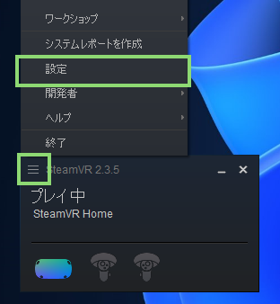
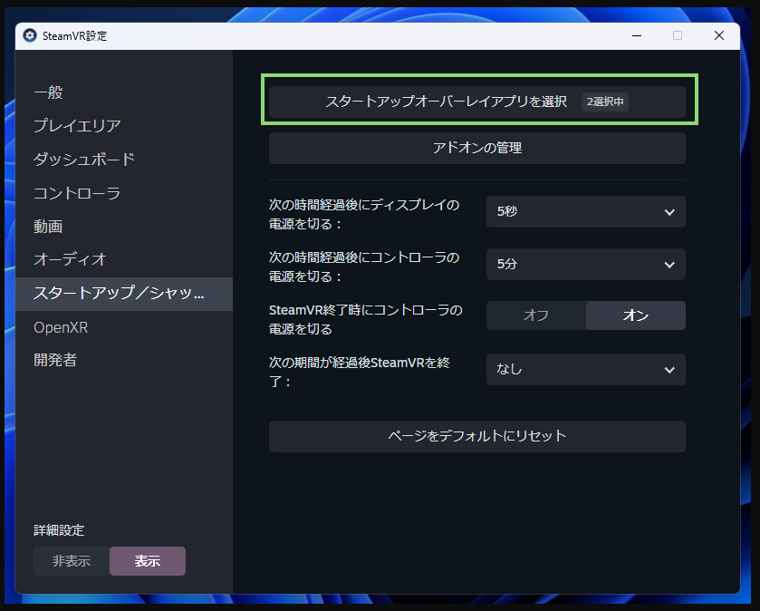
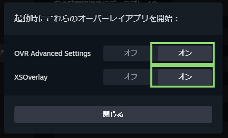

# PCVRでVRChatするときに入れたいアプリ

## インストール
まずは以下の2つをインストールしましょう。  
XSOverrayは有料(執筆時1,010円)ですが、買って損はありません。

- XSOverray
[Steam](https://store.steampowered.com/app/1173510/XSOverlay/?l=japanese)
- OVR Advanced Settings
[Steam](https://store.steampowered.com/app/1009850/OVR_Advanced_Settings/?l=japanese)

## 自動起動設定
両アプリを、SteamVRが起動した際に自動起動するように設定します。

 

設定が完了したら、SteamVRを再起動しましょう。

## XSOverray
スタートアップするだけで利用可能です。  
VRChatを起動すると、左手に時計やコントローラーの電池残量などが表示されます。  
歯車アイコンから諸々設定可能です。

[詳細はこのページが詳しいです。](https://metacul-frontier.com/?p=4921)

## OVR Advanced Settings
VRChat内で「浮く」ことができます(SpaceDrag)。  
最初にコントローラーの設定が必要なので、そこだけ解説します。

### 設定内容
右利き向けの設定です。左利きの方は読み替えてください。

#### Quest
右コントローラーのスティック上下に、浮く(SpaceDrug)を設定します
### VIVE
右コントローラーのメニューボタンに、浮く(SpaceDrug)を設定します

### 設定方法
SteamVRのメニュー(Questなら左コントローラーのメニューボタン、VIVEならシステムボタン)を開きます。

画面の下に「ADV」と書かれたアイコンがあるので、選択します。

左のメニューから「Motion」を選択し

「SpaceDrag」の「Right Hand」にチェックを入れます。  
（両方入っていても問題ないですが、将来の混乱を防ぐために使う方だけチェックをいれます）
  
チェックを入れたら、左上の矢印（←）で戻りましょう。

次に、「Binding」を選択します
ここでは、実際にどのボタンにどの操作を割り当てるかを設定します。

#### Quest Controller

#### VIVE Controller 1.0